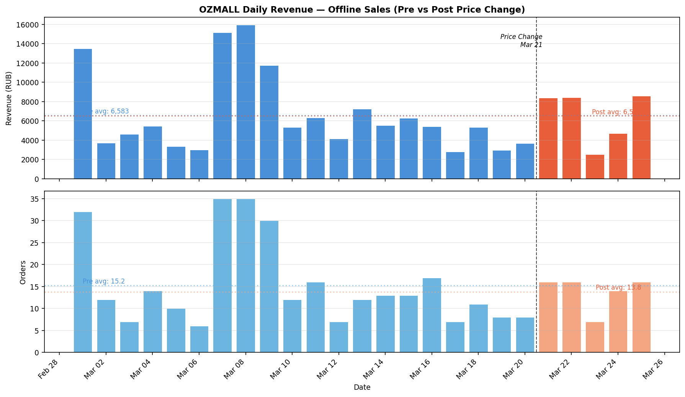
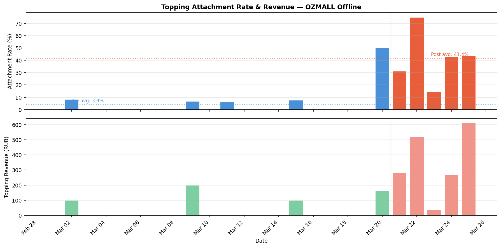
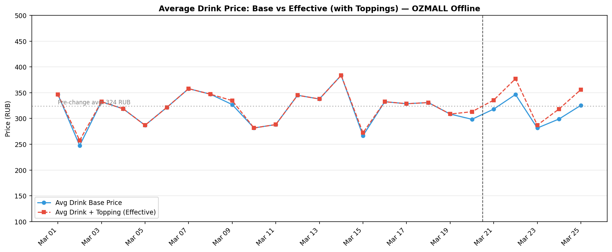
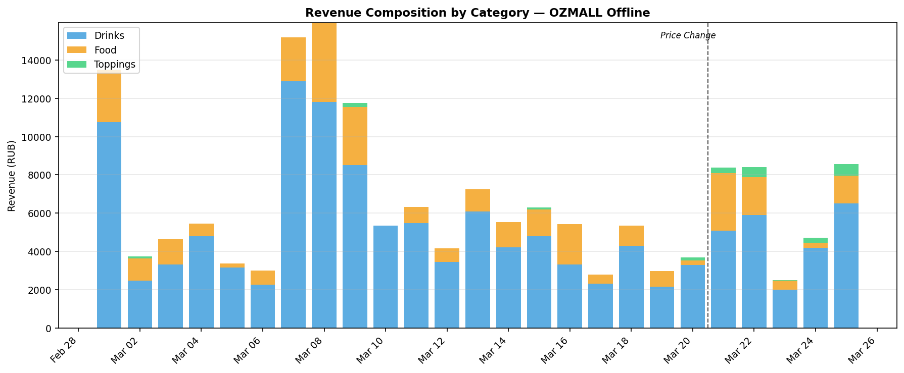
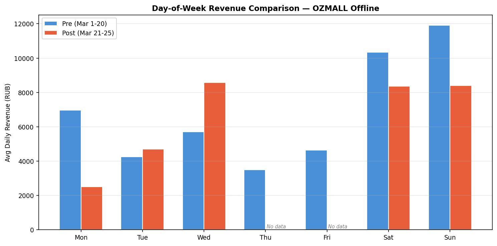

# OZMALL Pricing Strategy Analysis: Pre vs Post Price Change

**Date:** March 26, 2026
**Period analyzed:** March 1-25, 2026
**Pre-change:** March 1-20 (20 days) | **Post-change:** March 21-25 (5 days)

---

## Background

On March 21, OZMALL shifted to an unbundled pricing model: drink base prices were reduced by ~30-50 RUB (8-12%), and toppings (tapioca, juice balls, coconut, etc.) are now charged separately at 40-50 RUB each. Online delivery prices remain at the old (bundled) price points. The goal is to increase order volume through a lower entry price while recovering margin via topping upsells.

---

## Key Findings

### 1. Daily Revenue: Flat (-1.1%)

| Metric | Pre (20 days) | Post (5 days) | Change |
|---|---|---|---|
| Daily avg revenue | 6,583 RUB | 6,514 RUB | -1.1% |
| Daily avg orders | 15.2 | 13.8 | -9.4% |
| Daily avg items sold | 22.1 | 19.4 | -12.4% |
| Avg ticket per order | 432 RUB | 472 RUB | +9.4% |

Top-line daily revenue is essentially unchanged. However, this is being achieved with fewer orders at a higher average ticket, not the volume increase the strategy intended.

### 2. Topping Attachment: Major Success (3% to 45%)

| Metric | Pre | Post | Change |
|---|---|---|---|
| Attachment rate | 3.0% | 44.9% | +42pp |
| Daily topping qty | 0.6 | 8.0 | +1,233% |
| Daily topping revenue | 28 RUB | 344 RUB | +1,129% |

The unbundling strategy transformed topping sales from nearly non-existent to a meaningful revenue stream. Nearly half of all post-change orders include at least one topping add-on.

### 3. Effective Drink Price: Actually Higher (+19 RUB)

| Metric | Value |
|---|---|
| Pre avg drink price (bundled) | 324 RUB |
| Post avg drink base price | 320 RUB |
| Post avg drink + topping uplift | 343 RUB |
| **Net effect per drink** | **+19 RUB (+5.9%)** |

The price cuts are fully offset by topping revenue. Customers paying for toppings are effectively paying *more* than the old bundled price. This is the strongest positive signal in the data.

### 4. Revenue Mix: Toppings Now Visible

| Category | Pre daily avg | Post daily avg | Change |
|---|---|---|---|
| Drinks | 5,233 RUB (79.5%) | 4,729 RUB (72.6%) | -9.6% |
| Food | 1,322 RUB (20.1%) | 1,440 RUB (22.1%) | +8.9% |
| Toppings | 28 RUB (0.4%) | 344 RUB (5.3%) | +1,129% |

Drink revenue dropped as expected from price cuts, but food and toppings are picking up share. Notably, food items (corn dogs, blini) actually saw price *increases* of 8-25% alongside the drink cuts.

---

## Challenges With This Analysis

### Day-of-week bias is the biggest problem

The post period (Mar 21-25) covers Sat-Sun-Mon-Tue-Wed. The pre period has 20 days across all weekdays. Weekends at OZMALL generate ~2x the revenue of weekdays:

| Day | Pre avg revenue | Post avg revenue |
|---|---|---|
| Saturday | 10,350 | 8,370 |
| Sunday | 11,917 | 8,410 |
| Wednesday | 5,708 | 8,570 |
| Tuesday | 4,258 | 4,708 |
| Monday | 6,967 | 2,510 |
| Thursday | 3,488 | *no data* |
| Friday | 4,648 | *no data* |

Post-period Saturday and Sunday revenue dropped 19-29% vs pre-period weekend averages. This could mean the price change is hurting weekend traffic, but **each post day-of-week has only 1 data point** -- any single slow Saturday would skew this heavily. Meanwhile, post Wednesday (+50%) and Tuesday (+11%) look strong.

### Other limitations

- **5 days is too short.** With high daily variance (2,500-16,000 RUB range), 5 days cannot establish a reliable trend. A single rainy Saturday or a school holiday can swing the averages.
- **No control group.** We're comparing OZMALL to itself across time. Ideally, another store with unchanged pricing would serve as a control to isolate the pricing effect from external factors (weather, foot traffic, seasonal trends).
- **Online channel went dark.** Pre-period had 23 online orders (25,500 RUB). Post-period has zero. If online wasn't updated yet, this is expected, but it represents lost revenue that should be accounted for in total store performance.
- **Product name changes.** Post-period drinks have "(shariki ne vklyucheny)" suffix. This means pre/post product-level comparisons require name normalization, and product_sales reports will show them as different products.

---

## Recommendations

### 1. Keep collecting data -- aim for 4 full weeks post-change
5 days is directionally interesting but not statistically meaningful. You need at least 2-3 complete weeks (covering all days of the week 2-3 times) before making any permanent decision.

### 2. Use another store as a control
Compare OZMALL's daily revenue trend against a stable store (e.g., VOLODYA or BON PASSAGE) over the same period. If all stores dipped on the same days, it's external factors, not pricing.

### 3. Track topping attachment by drink category
Not all drinks benefit equally from topping upsells. Cocktails and teas are natural topping pairings; coffee drinks less so. Understanding which drinks convert on toppings can inform staff training and menu design.

### 4. Investigate the online gap
Zero online orders post-change is a revenue leak. If the online menu hasn't been updated, prioritize it. If it was intentional, quantify the opportunity cost (~1,821 RUB/day based on pre-period).

### 5. Consider a price floor analysis
The unbundled model effectively creates a 2-tier pricing system: budget (no toppings) and premium (with toppings). Monitor whether the budget tier attracts genuinely new customers or just gives existing customers a cheaper option. The current data (fewer orders, not more) suggests the latter, but 5 days is too early to tell.

---

## Bottom Line

The topping unbundling is working mechanically -- attachment rates jumped from 3% to 45%, and effective per-drink revenue is actually *higher* than before. But the volume hypothesis (lower prices = more customers) has not materialized in 5 days. Daily revenue is flat, and order counts are slightly down.

**Verdict: Too early to call.** The topping upsell economics are sound, but 5 days with day-of-week skew cannot confirm whether the strategy drives incremental volume. Continue for 3-4 more weeks and compare against a control store before deciding to expand or revert.
